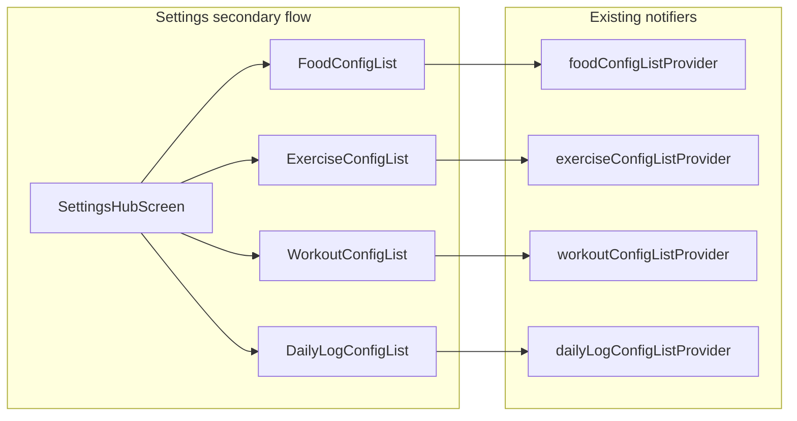

# Config presets UI + deferred follow-ups

## Context

[Domain CRUD plan](.cursor/plans/domain_crud_providers_68051baa.plan.md) is complete: repositories, seven `*ListProvider`s, and tests exist. Presentation is still the counter demo in [`app_root.dart`](flutter/weight_sovereignty/lib/src/presentation/app_root.dart).

**Config models** ([`domain/config/`](flutter/weight_sovereignty/lib/src/domain/config/)) are **presets/templates**, not day logs:

| Model | Role (per docs + code) |
|-------|-------------------------|
| [`FoodConfig`](flutter/weight_sovereignty/lib/src/domain/config/food_config.dart) | Recurring meals; `favorite` drives future “recent foods” on dashboard |
| [`ExerciseConfig`](flutter/weight_sovereignty/lib/src/domain/config/exercise_config.dart) | Exercise templates (category, type, intensity, defaults) |
| [`WorkoutConfig`](flutter/weight_sovereignty/lib/src/domain/config/workout_config.dart) | Named workout templates; `exercisePresetIds` references exercise presets |
| [`DailyLogConfig`](flutter/weight_sovereignty/lib/src/domain/config/dailylog_config.dart) | Named BMR / daily baseline presets |

Your memory matches the architecture: these belong in a **Settings / Presets** area, not the main dashboard or workout session (see [docs/development.md](docs/development.md) — dashboard = today’s `DailyLog`; food flow consumes `FoodConfig` favorites).

**Existing providers to use (no new persistence layer):**

- `foodConfigListProvider`, `exerciseConfigListProvider`, `workoutConfigListProvider`, `dailyLogConfigListProvider` from [`application/providers/providers.dart`](flutter/weight_sovereignty/lib/src/application/providers/providers.dart)
- API: `ref.watch(provider)`, `notifier.create`, `updateItem`, `delete`, `read(id)` via [`CrudListNotifierMixin`](flutter/weight_sovereignty/lib/src/application/crud/crud_list_notifier_mixin.dart)



---

## Milestone A — App shell + shared UI (prerequisite)

**Replace counter demo** with a minimal shell:

- [`presentation/theme/app_theme.dart`](flutter/weight_sovereignty/lib/src/presentation/theme/app_theme.dart) — dark Material 3 per [`.cursor/rules/android-and-ux.mdc`](.cursor/rules/android-and-ux.mdc) (`#121212`, flat, low elevation)
- [`presentation/screens/home_shell_screen.dart`](flutter/weight_sovereignty/lib/src/presentation/screens/home_shell_screen.dart) — temporary home: title + **Settings** entry (gear / list tile), not the final dashboard
- Update [`app_root.dart`](flutter/weight_sovereignty/lib/src/presentation/app_root.dart): apply theme; `home:` → `HomeShellScreen`

**Shared widgets** (avoid four copy-paste list screens):

- `AsyncListScaffold` — handles `AsyncValue<List<T>>`: loading, error + retry (`ref.invalidate(provider)`), empty state
- `ConfigListTile` — title (`name`), optional subtitle (macros / type / BMR), tap → edit, swipe or icon → delete with confirm
- `ConfigFormScaffold` — app bar Save, pop on success, show `SnackBar` on `IsarError` / validation failure

**Validation helpers** (presentation or thin `application/config/`):

- Required non-empty `name` before save
- On save for `ExerciseConfig`, set `categoryName` / `typeName` / `intensityLevelName` from enum `.name` (not only `@ignore` getters)
- Document unique-name behavior: Isar `@Index(unique: true, replace: true)` replaces on conflict — show a one-line note in UI or treat duplicate name as edit of existing row

---

## Milestone B — Settings hub + four CRUD flows

### B1 — Settings hub

[`presentation/screens/settings/settings_hub_screen.dart`](flutter/weight_sovereignty/lib/src/presentation/screens/settings/settings_hub_screen.dart)

Four tiles:

1. Food presets  
2. Exercise presets  
3. Workout templates  
4. Daily log profiles  

Simple `Navigator.push` — no bottom tabs (aligns with “no tab jungle”).

### B2 — Food presets

- **List:** [`food_config_list_screen.dart`](flutter/weight_sovereignty/lib/src/presentation/screens/settings/food_config_list_screen.dart) — `ref.watch(foodConfigListProvider)`; FAB → new; optional filter chip “Favorites only” using `listFavorites()` or client-side filter
- **Edit:** [`food_config_edit_screen.dart`](flutter/weight_sovereignty/lib/src/presentation/screens/settings/food_config_edit_screen.dart) — fields: name, favorite switch, kcal, protein/carbs/fat (g), amount, unit; Save → `create` / `updateItem`

### B3 — Exercise presets (most fields)

- **List:** name + subtitle `type · category`
- **Edit:** dropdowns for `ExerciseCategory`, `ExerciseType`, `IntensityLevel`; numeric fields for weight/reps/sets/distance/duration/burn; persist enum strings on save

### B4 — Daily log profiles

- **List / edit:** name + `bmrCaloriesKcal` only (smallest form; good first vertical slice if doing incremental PRs)

### B5 — Workout templates (depends on exercises)

- **List:** template name + count of linked exercises
- **Edit:** name + multi-select checklist of `ExerciseConfig` from `exerciseConfigListProvider` (by `name` into `exercisePresetIds`); disable save if no exercises exist yet (link to Exercise presets)

**Navigation pattern (each type):**

```
ListScreen --tap--> EditScreen(id?)
ListScreen --FAB--> EditScreen(new)
EditScreen --Save--> notifier.create/updateItem --> pop
ListScreen --delete--> confirm --> notifier.delete(id)
```

---

## Milestone C — Tests + cleanup

- Widget test: Settings hub renders four entries (override `isarProvider` / list providers with fakes if needed; or integration-style with test DB later)
- Remove [`widgets_controllers.placeholder`](flutter/weight_sovereignty/lib/src/presentation/widgets_controllers.placeholder) when real widgets exist
- Manual: `flutter run` on Android — CRUD each config type, restart app, data persists

---

## Carried over from first plan (not in this milestone)

Keep these explicit for the **next** plan after config UI:

| Task | Why later |
|------|-----------|
| Recalc `Calculation` on `DailyLog` from `foodIds` / `workoutIds` | Needs entity logging + services |
| MET / burn recalc before workout save | Workout **entity** flow |
| Static preset seeding (first-run defaults) | Optional after manual CRUD proven; can import JSON or hardcode seed in `LocalStorage.open` |
| Cascade delete / unlink Food/Workout from `DailyLog` | Entity CRUD |
| `getOrCreateForDay` on app startup | **Dashboard** milestone, not settings |
| Entity UI: `DailyLog`, `Food`, `Workout` logs | Consumes configs (e.g. tap favorite `FoodConfig` → create `Food`) |
| Final dashboard, morning weight, workout session | [docs/development.md](docs/development.md) core screens |

---

## Suggested implementation order

1. Theme + `HomeShellScreen` + route to Settings hub (remove counter)  
2. Shared `AsyncListScaffold` + delete confirm  
3. **FoodConfig** list + edit (proves pattern + favorites)  
4. **DailyLogConfig** list + edit  
5. **ExerciseConfig** list + edit (enums)  
6. **WorkoutConfig** list + edit (exercise picker)  
7. Widget test + Android smoke test  

---

## File map (new / changed)

```
lib/src/presentation/
  theme/app_theme.dart
  screens/home_shell_screen.dart
  screens/settings/
    settings_hub_screen.dart
    food_config_list_screen.dart
    food_config_edit_screen.dart
    exercise_config_list_screen.dart
    exercise_config_edit_screen.dart
    dailylog_config_list_screen.dart
    dailylog_config_edit_screen.dart
    workout_config_list_screen.dart
    workout_config_edit_screen.dart
  widgets/
    async_list_scaffold.dart
    config_list_tile.dart
lib/src/presentation/app_root.dart          # theme + home shell
test/presentation/settings_hub_test.dart    # optional
```

No changes to `domain/` or `data/` unless a small `ConfigSaveMapper` helper is added to normalize `ExerciseConfig` enum fields before `save` (recommended in `application/` to keep widgets thin).
