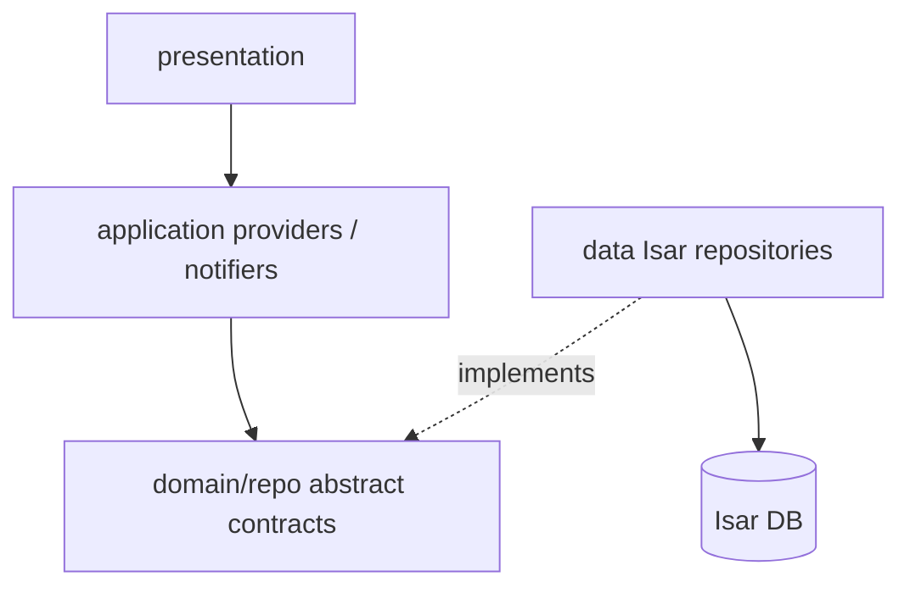

# Domain CRUD + Riverpod providers

## Current state (inconsistent)

| Location | Intended role | Actual content |
|----------|---------------|----------------|
| [`domain/repo/*.dart`](flutter/weight_sovereignty/lib/src/domain/repo/) | Repository **contracts** | TODO comments only (not interfaces) |
| [`data/*_repository.dart`](flutter/weight_sovereignty/lib/src/data/) | Isar **implementations** | Empty files |
| [`application/*_service.dart`](flutter/weight_sovereignty/lib/src/application/) | Use cases + providers | Empty |
| [`data/source/local/local_storage.dart`](flutter/weight_sovereignty/lib/src/data/source/local/local_storage.dart) | Open Isar once | Empty |

**Seven Isar collections** to support:

- **Entities (day logs):** `DailyLog`, `Food`, `Workout` — [`entity/`](flutter/weight_sovereignty/lib/src/domain/entity/)
- **Configs (presets):** `DailyLogConfig`, `FoodConfig`, `WorkoutConfig`, `ExerciseConfig` — [`config/`](flutter/weight_sovereignty/lib/src/domain/config/)

Embedded types (`FoodBase`, `ExerciseBase`, `Calculation`, …) are not separate CRUD targets.

## Architecture decision

**Keep the split defined in [`.cursor/rules/flutter-architecture.mdc`](.cursor/rules/flutter-architecture.mdc):**



- **Do not** put Isar code in `domain/repo/` (breaks dependency rule).
- **Do not** drop `data/*_repository.dart` in favor of only `domain/repo/` — that would mix persistence into domain.
- **Repurpose** `domain/repo/*.dart`: replace TODO stubs with real `abstract class` interfaces.
- **Implement** in `data/*_repository.dart` (or `data/repositories/` if you prefer a subfolder; flat `data/` matches existing layout).

**UI-facing API (first goal):** Riverpod `AsyncNotifier<List<T>>` per collection in `application/`, not widgets calling repositories directly. Thin `*_service.dart` files are **optional for this milestone** — use notifiers now; add `DailyLogService` later when recalc and `foodIds`/`workoutIds` orchestration land.

---

## Phase 1 — Foundation

### 1.1 Shared domain contract

Add [`domain/repo/crud_repository.dart`](flutter/weight_sovereignty/lib/src/domain/repo/crud_repository.dart):

```dart
abstract class CrudRepository<T> {
  Future<T?> getById(int id);
  Future<List<T>> getAll();
  Future<int> save(T entity);   // insert or update; returns Isar id
  Future<bool> deleteById(int id);
}
```

Add one interface per collection (extend `CrudRepository<T>` + typed queries):

| Interface file | Type | Extra queries (beyond CRUD) |
|----------------|------|-----------------------------|
| `dailylog_repo.dart` | `DailyLog` | `getByCalendarDay(DateTime day)`, `getOrCreateForDay(DateTime day)` |
| `food_repo.dart` | `Food` | `listByCalendarDay(DateTime day)`, `listByIds(List<int> ids)` |
| `workout_repo.dart` | `Workout` | same pattern as `Food` |
| `dailylog_config_repo.dart` | `DailyLogConfig` | `getByName(String name)` (optional) |
| `food_config_repo.dart` | `FoodConfig` | `listFavorites()` |
| `workout_config_repo.dart` | `WorkoutConfig` | — |
| `exercise_config_repo.dart` | `ExerciseConfig` | `listByCategory`, `getByName` (optional) |

Replace TODO-only content in existing three `*_repo.dart` files; **add four new** config repo interfaces (configs currently have no `domain/repo` stubs).

### 1.2 Date normalization utility

Add [`domain/util/date_only.dart`](flutter/weight_sovereignty/lib/src/domain/util/date_only.dart):

- `DateTime toCalendarDay(DateTime dt)` — local midnight truncation for queries and `getOrCreateForDay`.

Use everywhere date filtering happens so list-by-day is consistent with docs (“anchor to a day”).

### 1.3 Index `date` on entities (small model change)

On [`DailyLog`](flutter/weight_sovereignty/lib/src/domain/entity/dailylog.dart), [`Food`](flutter/weight_sovereignty/lib/src/domain/entity/food.dart), [`Workout`](flutter/weight_sovereignty/lib/src/domain/entity/workout.dart):

```dart
@Index()
DateTime? date;
```

Run code gen:

```bash
cd flutter/weight_sovereignty && dart run build_runner build --delete-conflicting-outputs
```

### 1.4 Isar bootstrap

Implement [`local_storage.dart`](flutter/weight_sovereignty/lib/src/data/source/local/local_storage.dart):

- `LocalStorage.open()` → `getApplicationDocumentsDirectory()` + `Isar.open([...all 7 schemas...])`
- Register schemas from entity/config `.dart` files (generated `*Schema` constants).
- `LocalStorage.close()` for tests/dispose if needed.

### 1.5 Generic Isar CRUD helper

Add [`data/source/local/isar_crud.dart`](flutter/weight_sovereignty/lib/src/data/source/local/isar_crud.dart):

- Thin wrapper: `getById`, `getAll`, `put` inside `writeTxn`, `delete` by id.
- Typed repos pass `IsarCollection<T>` accessor (`isar.foods`, `isar.dailyLogs`, …).

Implement seven classes in `data/` (e.g. `IsarFoodRepository implements FoodRepository`) — one file per model, delegating to `IsarCrud` + collection-specific filters using `.filter().dateEqualTo(day).findAll()` after index is added.

**`getOrCreateForDay` (DailyLog):** normalize day → `getByCalendarDay` → if null, `save(DailyLog()..date = day)` → return. No dialog, no UI — matches docs startup flow and is the only non-generic repo logic in phase 1.

---

## Phase 2 — Riverpod wiring

### 2.1 Core providers

Add [`application/providers/isar_provider.dart`](flutter/weight_sovereignty/lib/src/application/providers/isar_provider.dart):

```dart
final isarProvider = FutureProvider<Isar>((ref) => LocalStorage.open());
```

Add [`application/providers/repository_providers.dart`](flutter/weight_sovereignty/lib/src/application/providers/repository_providers.dart):

- One `Provider<XRepository>` per interface; `ref.watch(isarProvider).requireValue` (or guard with clear error while loading).
- `keepAlive: true` on `isarProvider` / repository providers to avoid reopening DB.

### 2.2 Bootstrap in `main.dart`

[`main.dart`](flutter/weight_sovereignty/lib/main.dart):

```dart
void main() async {
  WidgetsFlutterBinding.ensureInitialized();
  runApp(const ProviderScope(child: AppRoot()));
}
```

Keep async open via `isarProvider` (no pre-open required). Update [`app_root.dart`](flutter/weight_sovereignty/lib/src/presentation/app_root.dart) minimally: `ref.watch(isarProvider)` → show `CircularProgressIndicator` on loading, error text on failure, then existing `MaterialApp` (counter demo can stay until real screens).

### 2.3 CRUD notifiers (UI API)

Per collection, add e.g. [`application/food/food_list_notifier.dart`](flutter/weight_sovereignty/lib/src/application/food/food_list_notifier.dart):

```dart
final foodListProvider =
    AsyncNotifierProvider<FoodListNotifier, List<Food>>(FoodListNotifier.new);

class FoodListNotifier extends AsyncNotifier<List<Food>> {
  @override
  Future<List<Food>> build() =>
      ref.read(foodRepositoryProvider).getAll();

  Future<Food> create(Food item) async { ... invalidate list ... }
  Future<Food> update(Food item) async { ... }
  Future<void> delete(int id) async { ... }
  Future<Food?> read(int id) =>
      ref.read(foodRepositoryProvider).getById(id);
}
```

Repeat for all **seven** types (naming: `dailyLogListProvider`, `foodConfigListProvider`, …).

**Optional convenience:** `FutureProvider.family<T?, int>` for single-item read without reloading full list — only if needed; list notifier + `read(id)` is enough for milestone 1.

### 2.4 Barrel export

Add [`application/providers/providers.dart`](flutter/weight_sovereignty/lib/src/application/providers/providers.dart) exporting all providers/notifiers so UI imports one library.

---

## Phase 3 — Correctness fixes (while in repo code)

### 3.1 Enum string persistence

In [`exercise_config.dart`](flutter/weight_sovereignty/lib/src/domain/config/exercise_config.dart) / [`ExerciseBase`](flutter/weight_sovereignty/lib/src/domain/entity/workout.dart):

- `getCategoryFromString` / similar: compare to `enumValue.name`, not `toString()`.
- When saving configs or exercises, write `category.name`, `type.name`, `intensityLevel.name`.

### 3.2 Explicitly out of scope for this plan

Defer to a **follow-up milestone** (do not block CRUD providers):

- Recalc `Calculation` on `DailyLog` from linked `foodIds` / `workoutIds`
- MET calorie burn before workout save
- Static presets seeding (old TODOs in repo files)
- Cascade delete / unlink when removing `Food` or `Workout`
- `riverpod_generator` / `@riverpod` (not in `pubspec.yaml`; manual providers are fine)

Document in code comments on `DailyLogListNotifier` that aggregate updates are TODO.

---

## Phase 4 — Tests

Add [`test/data/isar_food_repository_test.dart`](flutter/weight_sovereignty/test/data/isar_food_repository_test.dart) (and one for `DailyLogRepository.getOrCreateForDay`):

- Open Isar in temp directory with subset or full schemas.
- CRUD round-trip: save → getById → getAll → update → delete.
- Date filter: two foods on different days → `listByCalendarDay` returns one.

Override `isarProvider` in widget tests later; not required for milestone 1.

---

## Target file map (new / changed)

```
lib/src/domain/repo/
  crud_repository.dart          NEW
  dailylog_repo.dart            REPLACE stubs
  food_repo.dart                REPLACE stubs
  workout_repo.dart             REPLACE stubs
  dailylog_config_repo.dart     NEW
  food_config_repo.dart         NEW
  workout_config_repo.dart      NEW
  exercise_config_repo.dart     NEW
lib/src/domain/util/date_only.dart   NEW
lib/src/data/source/local/
  local_storage.dart            IMPLEMENT
  isar_crud.dart                NEW
lib/src/data/
  dailylog_repository.dart      IMPLEMENT (IsarDailyLogRepository)
  food_repository.dart          IMPLEMENT
  workout_repository.dart       IMPLEMENT
  dailylog_config_repository.dart   NEW
  food_config_repository.dart       NEW
  workout_config_repository.dart    NEW
  exercise_config_repository.dart   NEW
lib/src/application/providers/
  isar_provider.dart            NEW
  repository_providers.dart     NEW
  providers.dart                NEW (barrel)
lib/src/application/{dailylog,food,workout,...}/
  *_list_notifier.dart          NEW (×7)
lib/main.dart                   minor
lib/src/presentation/app_root.dart   isar loading gate
entity/*.dart                   @Index on date (×3)
```

---

## Suggested implementation order

1. `crud_repository.dart` + all seven interfaces  
2. `local_storage.dart` + `isar_crud.dart` + one repo (`Food`) to validate pattern  
3. Remaining six repositories + date index + code gen  
4. `isarProvider` + `repository_providers`  
5. Seven list notifiers + barrel export  
6. `app_root` loading gate + tests  
7. Enum `.name` fix  

After this milestone, UI can:

```dart
await ref.read(foodListProvider.notifier).create(food);
final foods = ref.watch(foodListProvider);
await ref.read(dailyLogListProvider.notifier).read(id);
```

with no direct Isar access from presentation.
