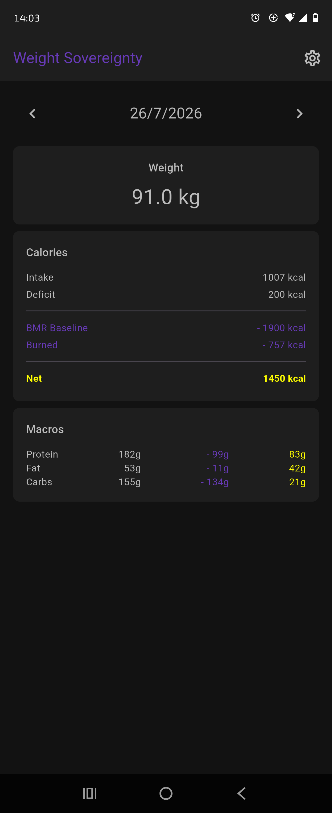
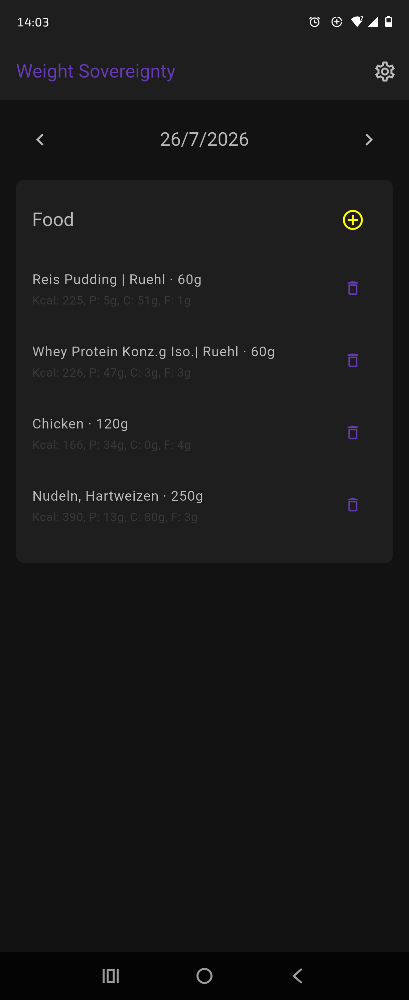
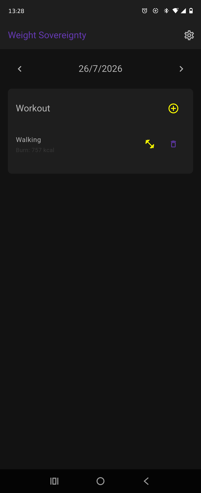
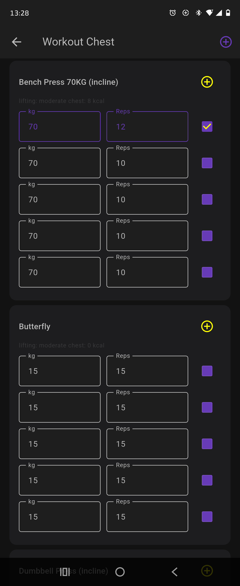
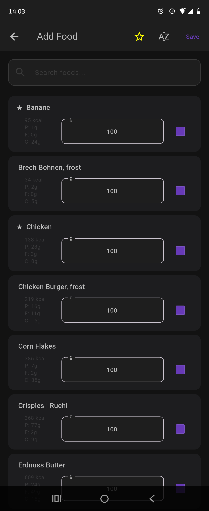
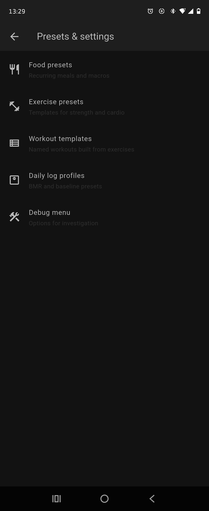
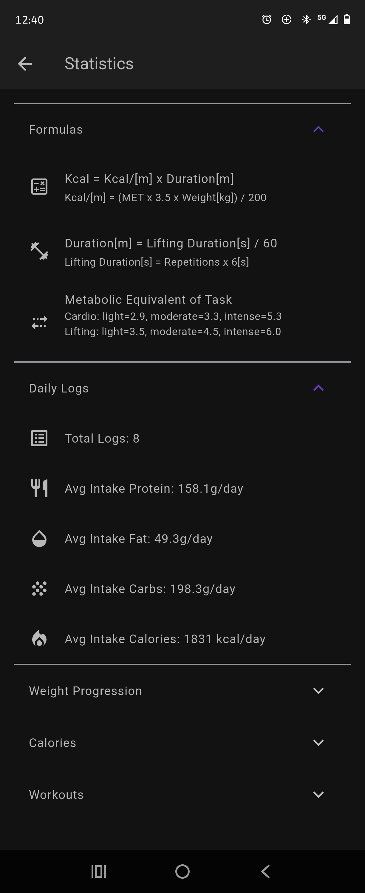
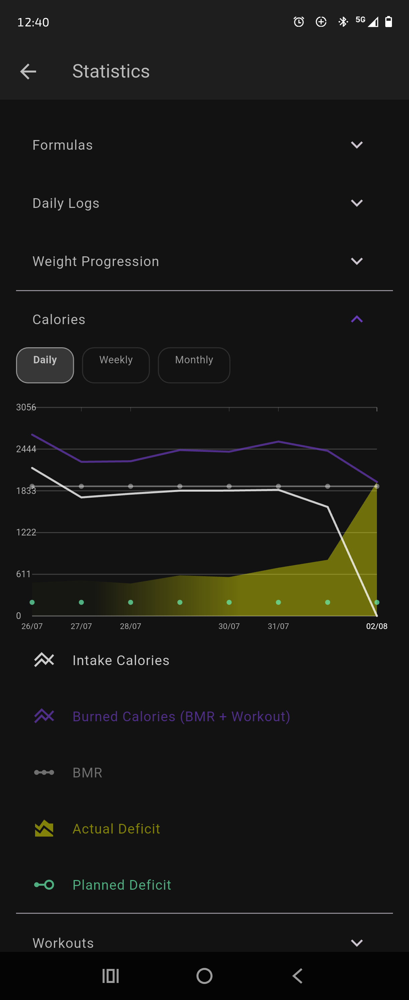
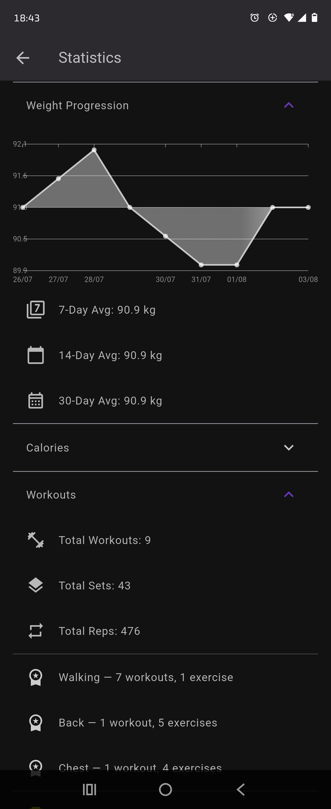

# Project weight-sovereignty

... app to self-control your body weight

- [Project weight-sovereignty](#project-weight-sovereignty)
  - [**DISCLAIMER**](#disclaimer)
  - [Purpose](#purpose)
  - [Core Principles](#core-principles)
  - [Non-Goals](#non-goals)
  - [Non-Negotiables](#non-negotiables)
  - [Further documentation](#further-documentation)

## **DISCLAIMER**

> This is a personal project.
> 
> No support guaranteed.
> 
> Pull requests welcome.
> 
> Issues may not be answered.
> 
> **I'm not obligated to respond. Open source ≠ unpaid tech support.**

## Purpose

A private, offline-first fitness tracking app built for long-term consistency, independence, and clarity.
No gamification. No manipulation. No external validation.

## Preview

|  |  |  |
|----------------------------|----------------------------|----------------------------|
|  |  |  |
|  |  |  |

## Core Principles

**1. Local Sovereignty**

* All data stored locally
* No accounts
* No cloud dependency
* Exportable at any time (CSV)

**2. Frictionless Logging**

* Food logging under 5 seconds
* Workout logging under 5 seconds
* Weight logging under 2 taps
* No required fields that don’t serve the user

**3. Transparent Calculations**

* All formulas visible and explainable
* No hidden “AI magic”
* No black-box calorie adjustments
* Adaptive engine fully inspectable

**4. Minimal Cognitive Load**

* One primary dashboard
* No notifications
* No streak pressure
* No engagement tricks

**5. Craft Over Product**

* Built for correctness, not marketability
* Clean architecture
* Deterministic behavior
* Zero emotional maintenance

## Non-Goals

* Social features
* Cloud sync
* Gamification
* Marketplace food database
* Public support obligations

## Non-Negotiables

* Offline-first
* Zero required updates
* All formulas transparent
* One-tap export to CSV
* No feature unless it reduces friction

## Milestones

* [milestones.md](./docs/milestones.md): details about the curret state and upcoming features and planned TODOs

## Further documentation

* [development.md](./docs/development_kickoff.md): details about the project domain, UX and architecture